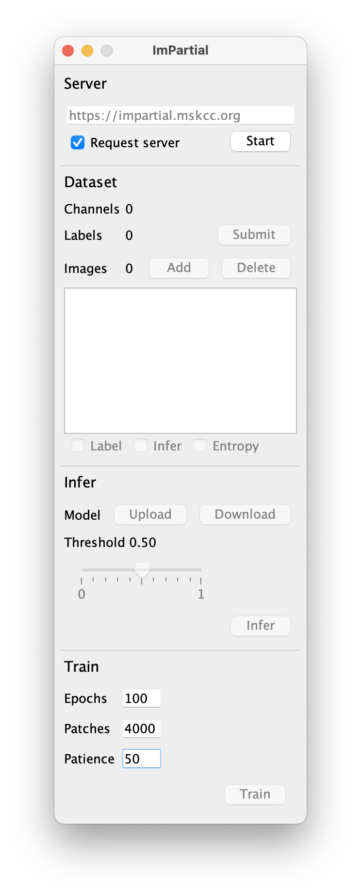
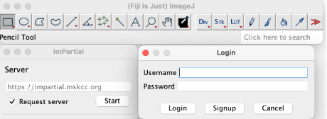
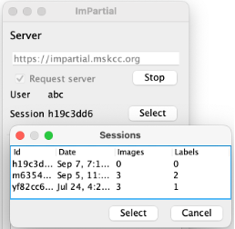

## ImageJ/Fiji Plugin

-   Download [Fiji](https://imagej.net/software/fiji/downloads) (version >= 2.3.0)

-   For ready-to-use ImPartial plugin, user can get a pre-compiled .jar file [here](imagej-plugin/impartial_imagej-0.1.jar).  Copy the `.jar` file into Fiji's plugins directory. For example, if you're using macOS
```shell
cp ~/Downloads/impartial_imagej-0.1.jar /Applications/Fiji.app/plugins
```

-   Restart **Fiji**
-   From `Plugins` menu bar, open `ImPartial` 
-   Or Search `ImPartial` in Search bar as shown below and click `Run` 
    


## No-Code Cloud Execution

User can request our cloud deployed MONAI server to readily annotate and segment the data without needing to compile or run any code locally. 

 


## Plugin Features

### MONAI Setup

#### Local setup 
-	Start the monai server:  monailabel start_server -a api -s  /dataset/
-	http://localhost:8000
-	All the data with the labels are saved at the “/dataset/” location given by the user when starting the server. 

#### GPU server request
-	Signup with credentials

    
-   Login with your user ID

    

### User Session
-	User session is saved for each user with date and time as the id. User has access to the previous sessions. 
-	Each user session has a window of 2 hours at each login with a 5 min warning before the session ends. 
-	Restore session: User can restore the session by login-in with their credentials and clicking “select”

    

### Dataset images 
- Click “ADD” to upload your images.
- Impartial supports .png and .tiff file formats 
- Multichannel images upto 3 channels 
- Example dataset: [VECTRA_2CH](data/Vectra_WC_2CH_tiff)

### Creating Labels 
-	Use the ‘selection brush tool’ from the Fiji toolbar

    

-	After creating each label add each label to the Roi Manager add label option. 
-	After all the labels are added for the image, press submit to upload the labels on the server. (Warning: do not switch to another image before submitting, otherwise your labels will not be saved)

    

-	User can also upload previously created/saved labels eg. “roi.zip” by clicking File > open > imageLabel.zip


### Upload pre-trained model 
- User can upload a pre-trained model for inference and/or fine-tuning. 
- Example [vectra_2ch.pt]()


### Infer
-	Press Infer to view the predictions. User can also change the thresholding to fine tune the results in real time.


### Save model 
- User can download the trained model for future training/inference.


### Training

-	Training Hyperparameters: 
User can set the training hyperparameters according to the dataset and requirements. We recommend: 
```yaml
training:
  epochs: 200
  patches: 4000
  patience: 50
```
-	Click 'start' to begin training.
-	User can see the progress of the training of number of epochs completed on Fiji toolbar. 
