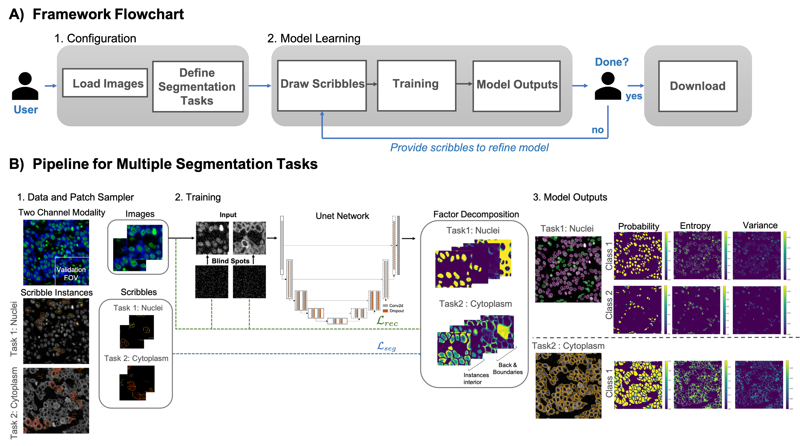

<!-- PROJECT LOGO -->
<br />
<p align="center">
    
    <h3 align="center"><strong>ImPartial: Interactive deep learning whole-cell segmentation using partial annotations</strong></h3>
    <p align="center">
    <a href="https://doi.org/10.1101/2021.01.20.427458">Read Link</a>
    |
    <a href="https://colab.research.google.com/drive/1kocZUgvi56I9-XjWiwNUzEAzswAPJB-d">Google CoLab Demo</a>
    |
    <a href="https://github.com/nadeemlab/ImPartial/issues">Report Bug</a>
    |
    <a href="https://github.com/nadeemlab/ImPartial/issues">Request Feature</a>
  </p>
</p>

\
Segmenting noisy multiplex spatial tissue images is a challenging task, since the characteristics of both the noise and the biology being imaged differs significantly across tissues and modalities; this is compounded by the high monetary and time costs associated with manual annotations. It is therefore important to create algorithms that can accurately segment the noisy images based on a small number of annotations. *With ImPartial, we have developed an algorithm to perform segmentation using only 2-3 training images with few user-provided scribbles. ImPartial augments the segmentation objective via self-supervised multi-channel quantized imputation, meaning that each class of the segmentation objective can be characterized by a mixture of distributions. This is based on the observation that perfect pixel-wise reconstruction or denoising of the image is not needed for accurate segmentation, and hence a self-supervised classification objective that better aligns with the overall segmentation goal suffices. We demonstrate the superior performance of our approach for a variety of datasets acquired with different highly-multiplexed imaging platform.*

This repository provides training and testing pipeleine using the ImPartial framework.

## Prerequisites:
```
NVIDIA GPU (Tested on NVIDIA GPU)
CUDA CuDNN (CPU mode and CUDA without CuDNN may work with minimal modification)
pandas>=1.2.4
numpy>=1.20.1
torchvision>=0.2.1
torch>=0.5.0
scikit-image>=0.18.1
scikit-learn>=0.24.1
scipy>=1.6.2
```

## Getting Started with ImPartial


## Terminology
```

pd_files.csv: list of training / testing images
pd_files_scribbles.csv: list of training images with scribbles
nclasses: number of classes for segmentation tasks
rec_channels: number of reconstruction channels
```

## Datasets

| Dataset  | Description |
| ------------- | ------------- |
| `MIBI`  | 4  2-channel mibi images, segmentation classes: cytoplasm, nuclei in cytoplasm, nuclei out of cytoplasm  |
| `Vectra`  | 8  2-channel Vectra images, segmentation classes: cytoplasm, nuclei in cytoplasm, nuclei out of cytoplasm  |
| `TissueNet`  | https://datasets.deepcell.org/  |
| `Cellpose`  | https://www.cellpose.org/  |


## Pipeline


*(A) Overview of the ImPartial pipeline. (B) Each image patch is separated into an imputation patch and a blind spot patch. The blind spot patch is fed through the U-Net to recover the component mixture and the component statistics. The latter statistics are averaged across the entire patch to enforce component consistency. Both the component statistics and component mixture are used to compute the mixture loss for the patch. Simultaneously, a scribble containing a small number of ground truth segmentations for the patch is used to compute the scribble loss. Both losses propagate gradients back to the U-Net architecture on the backward pass.*

## Data Preparation and Preprocessing

### Steps
* Create dataset for ImPartial training
* Select training images split into train, val, test sets
* Use preprocessing files to generate input .npz files
* If ground truth labels are available:
  * Use automated skeltonization on ground truth labels to generate scribbles .npz files
* If NO ground truth labels:
  * Create scribbles using [Deepcell label](https://github.com/vanvalenlab/deepcell-label) or other annotation tools such as ImageJ

  
### Code

There are two notebooks for preparing and processing a dataset. 

* Prepare_dataset.ipynb
	1. Load the dataset
	2. Select the images you want to use (save_list)
	3. Select the images from (save_list) to be used in training (train_list). Remaining images to be used in test.
	4. Set (savedir) path to save .npz files.
	5. Create `files.csv` which contains names (prefix) and path (input_dir) of train and test images (group)
  

* Preprocessing.ipynb (Automated scribble generation of training image from ground truth labels)
	1. Read files.csv
	2. Get number of instances per segmentation class
	3. Define number of scribbles for labels
	4. Define percentage validation region (val_perc = 0.4)
	5. Scribbles .npz file is saved in the input_dir path defined in pd_files (files.csv)
	6. Scribbles .csv file is also saved (contains parameters related to scribbles)


## Training 

Create the following dataset-specific training configuration in main_impartial.py:
```
n_channels = number of input image channels
classification_tasks = a python dict of tasks and corresponding number of classes, recunstruction channels
```

```python
    if cparser.dataset == 'Deepcell':
        scribble_fname = 'files_2tasks_10images_scribble_train_' + cparser.scribbles + '.csv'
        files_scribbles = os.path.join(data_dir, scribble_fname)
        pd_files_scribbles = pd.read_csv(files_scribbles) #scribbles

        n_channels = 2
        classification_tasks = {'0': {'classes': 1, 'rec_channels': [0,1], 'ncomponents': [2, 2]},
                                '1': {'classes': 1, 'rec_channels': [0], 'ncomponents': [1, 2]}}
```

	
* Select/ adjust training parameters 
  * Set input file paths in (impartial_bash.sh) file
  ```
    data_dir = "path to data directory containg .npz files"
	data_dir = '/nadeem_lab/Gunjan/data/impartial/' # example
  ```
  * Set output file paths in (impartial_bash.sh) file
  ```
    basedir_root = " path to output files "
	basedir_root = "/nadeem_lab/Gunjan/experiments/deepcell/models/" # example
  ```
  * Set dataset name
  * Set mcdropout, checkpoint ensembles, no. of epochs etc. 
	
	
* Training output is represented as .pickle file
  ```
  - output is a dictionary with tasks as keys (in case of 2 tasks [0,1], in case of 1 task [0])
  - each output[task] is a dictionary with:
	- 'class_segmentation': np.array size = (batch x nclasses x h x w) 
	- 'class_segmentation_variance': np.array size = (batch x nclasses x h x w)
  ```


Example training command
```
CUDA_VISIBLE_DEVICES=0 python3.8 main_impartial.py 
				--basedir=$basedir_root"Deepcell/s400/Impartial/" 
				--dataset="Deepcell" 
				--model_name="Im_2tasks_base64depth4relu_adam5e4_mcdrop1e4_nsave5_segCEGauss_w04501_seed42" 
				--saveout=True 
				--scribbles=400 
				--gpu=0 
				--optim_regw=0.0001 
				--optim="adam" 
				--lr=0.0005 
				--gradclip=0 
				--seed=42 
				--train=True 
				--udepth="4" 
				--ubase="64" 
				--activation="relu" 
				--batchnorm=False 
				--seg_loss="CE" 
				--rec_loss="gaussian" 
				--nsaves=5 
				--mcdrop=True 
				--reset_optim=True 
				--reset_validation=False 
				--wfore=0.45 
				--wback=0.45 
				--wrec=0.1 
				--wreg=0.0 
				--ratio=0.95 
				--epochs=300 
				--batch=64 
				--load=False 
				
				> "output/path/to/logs"
```

## Evaluation using Pretrained model

To test the model use the following sample command. 
Modify the basedir, dataset, model_name to test a different model. 
Sample Premodels can be downloaded here.

Example evalualtion command
```
CUDA_VISIBLE_DEVICES=0 python3.8 main_impartial.py \
				--basedir=$basedir_root"Deepcell/s400/Impartial/" \
				--dataset="Deepcell" \
				--model_name="Im_2tasks_base64depth4relu_adam5e4_mcdrop1e4_nsave5_segCEGauss_w04501_seed42" \
				--saveout=True \
				--scribbles=400 \
				--gpu=0 \
				--optim_regw=0.0001 \
				--optim="adam" \
				--lr=0.0005 \
				--gradclip=0 \
				--seed=42 \
				--train=False \
				--udepth="4" \
				--ubase="64" \
				--activation="relu" \
				--batchnorm=False \
				--seg_loss="CE" \
				--rec_loss="gaussian" \
				--nsaves=5 \
				--mcdrop=True \
				--reset_optim=True \
				--reset_validation=False  \
				--wfore=0.45 \
				--wback=0.45 \
				--wrec=0.1 \
				--wreg=0.0 \
				--ratio=0.95  \
				--epochs=300 --batch=64 \
				--load=True 

				> "output/path/to/logs"

```


## Demo with [DeepCell Label](https://github.com/vanvalenlab/deepcell-label)

This is a proof of concept demo of integration of ImPartial with DeepCell-Label for doing interactive deep learning whole-cell segmentation using partial annotations. 
Here you see the results after every few epochs during training of ImPartial on Tissuenet dataset.

**Figure2**. *Nuclie segmentation.* The nuclie in input sample is give a few foreground(white) and background(red) scribbles. Image shows intermediate results after every 10th epoch. Final predictons are overlayed on ground truth.


**Figure3**. *Cytoplasm segmentation.* The cytoplasm in input sample is give a few foreground(white) and background(red) scribbles. Image shows intermediate results after every 10th epoch. Final predictons are overlayed on ground truth.

## Google CoLab:
If you don't have access to GPU or appropriate hardware, we have also created [Google CoLab project](https://colab.research.google.com/drive/1kocZUgvi56I9-XjWiwNUzEAzswAPJB-d) for your convenience. Please follow the steps in the provided notebook to install the requirements and run the training and testing scripts. All the libraries and pretrained models have already been set up there. The user can directly run ImPartial on their dataset using the instructions given in the Google CoLab project. 


## Issues
Please report all issues on the public forum.


## License
© [Nadeem Lab](https://nadeemlab.org/) - ImPartial code is distributed under **Apache 2.0 with Commons Clause** license, and is available for non-commercial academic purposes. 


## Reference
If you find our work useful in your research or if you use parts of this code, please cite our paper:
```
@article {Martinez2021.01.20.427458,
	author = {Martinez, Natalia and Sapiro, Guillermo and Tannenbaum, Allen and Hollmann, Travis J. and Nadeem, Saad},
	title = {ImPartial: Partial Annotations for Cell Instance Segmentation},
	elocation-id = {2021.01.20.427458},
	year = {2021},
	doi = {10.1101/2021.01.20.427458},
	publisher = {Cold Spring Harbor Laboratory}
}
```
