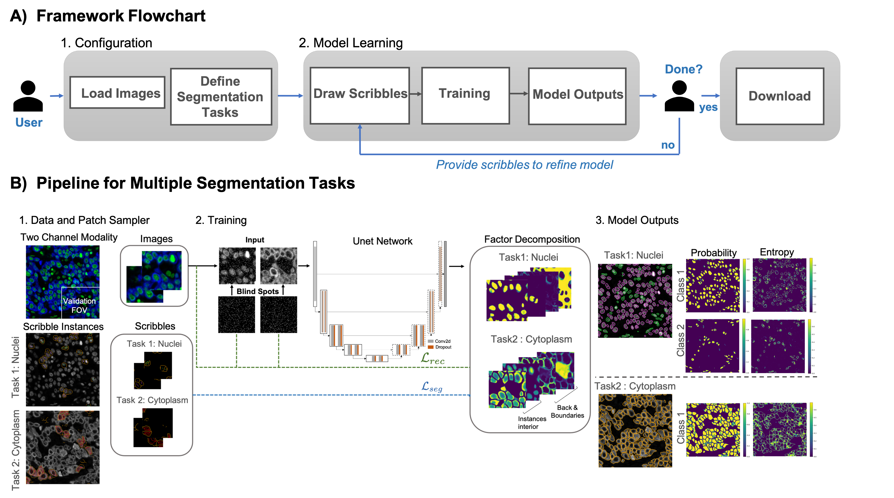

<!-- PROJECT LOGO -->
<br />
<p align="center">
    
    <h1 align="center"><strong>Interactive deep learning whole-cell segmentation and thresholding using partial 
		annotations</strong></h1>
    <p align="center">
    <a href="https://doi.org/10.1101/2021.01.20.427458">Read Link</a> |
    <a href="https://github.com/nadeemlab/ImPartial/issues">Report Bug</a> |
    <a href="https://github.com/nadeemlab/ImPartial/issues">Request Feature</a>
  </p>
</p>

Segmenting noisy multiplex spatial tissue images is a challenging task, since the characteristics of both the noise and 
the biology being imaged differs significantly across tissues and modalities; this is compounded by the high monetary 
and time costs associated with manual annotations. It is therefore important to create algorithms that can accurately 
segment the noisy images based on a small number of annotations. *With **ImPartial**, we have developed an algorithm to 
perform segmentation using as few as 2-3 training images with some user-provided scribbles. ImPartial augments the 
segmentation objective via self-supervised multi-channel quantized imputation, meaning that each class of the 
segmentation objective can be characterized by a mixture of distributions. This is based on the observation that perfect 
pixel-wise reconstruction or denoising of the image is not needed for accurate segmentation, and hence a self-supervised 
classification objective that better aligns with the overall segmentation goal suffices. We demonstrate the superior 
performance of our approach for a variety of datasets acquired with different highly-multiplexed imaging platform.*

## Pipeline


*(A) Overview of the ImPartial pipeline. (B) Each image patch is separated into an imputation patch and a blind spot 
patch. The blind spot patch is fed through the U-Net to recover the component mixture and the component statistics. The 
latter statistics are averaged across the entire patch to enforce component consistency. Both the component statistics 
and component mixture are used to compute the mixture loss for the patch. Simultaneously, a scribble containing a small 
number of ground truth segmentations for the patch is used to compute the scribble loss. Both losses propagate gradients 
back to the U-Net architecture on the backward pass.*


## MONAI Label

Pre-requisites
* Python 3

Install Python dependencies in a virtual environment using **pip**
```
python3 -m venv venv
source venv/bin/activate
pip install -U pip && pip install -r requirements.txt
```
Run MONAI Label app
```
cd impartial
monailabel start_server -a api -s <data-dir>
```

and navigate to http://localhost:8000 to access the [Swagger UI](https://github.com/swagger-api/swagger-ui)
for interactive API exploration.

## MONAI Label in Docker

Build the docker image
```shell
docker build -t monailabel/impartial .
```

run the image built above
```shell
docker run -d --name impartial -p 8000:8000 monailabel/impartial monailabel start_server -a api -s /opt/monai/data
```

and navigate to http://localhost:8000

## ImageJ/Fiji Plugin

Pre-requisites
* [Fiji](https://imagej.net/software/fiji/downloads)
* [Apache Maven](https://maven.apache.org/install.html) 
  (or use [brew](https://formulae.brew.sh/formula/maven) on macOS)

First, package the plugin. From the repo root directory
```shell
cd imagej-plugin
mvn clean package
```
and copy the `.jar` file into Fiji's plugins directory. For example, if you're using macOS
```shell
cp target/impartial_imagej-0.1.jar /Applications/Fiji.app/plugins
```

then restart **Fiji** and open `ImPartial` from the `Plugins` menu bar.

This repository provides a training and testing pipeline using the ImPartial framework.


## Issues
Please report all issues on the public forum.


## License
© [Nadeem Lab](https://nadeemlab.org/) - ImPartial code is distributed under **Apache 2.0 with Commons Clause** license, and is available for non-commercial academic purposes. 


## Reference
If you find our work useful in your research or if you use parts of this code, please cite our paper:
```
@article {Martinez2021.01.20.427458,
	author = {Martinez, Natalia and Sapiro, Guillermo and Tannenbaum, Allen and Hollmann, Travis J. and Nadeem, Saad},
	title = {ImPartial: Partial Annotations for Cell Instance Segmentation},
	elocation-id = {2021.01.20.427458},
	year = {2021},
	doi = {10.1101/2021.01.20.427458},
	publisher = {Cold Spring Harbor Laboratory}
}
```
