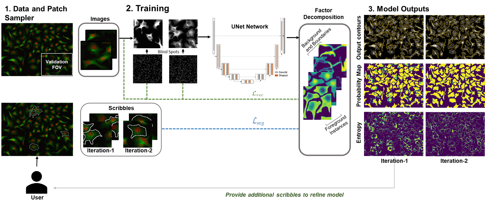

<!-- PROJECT LOGO -->
<br />
<p align="center">
    
    <h1 align="center"><strong>Interactive deep learning whole-cell Image segmentation and thresholding using Partial 
		annotations</strong></h1>
    <p align="center">
    <a href="https://doi.org/10.1101/2021.01.20.427458">Read Link</a> |
    <a href="https://github.com/nadeemlab/ImPartial/issues">Report Bug</a> |
    <a href="https://github.com/nadeemlab/ImPartial/issues">Request Feature</a>
  </p>
</p>

Segmenting noisy multiplex spatial tissue images is a challenging task, since the characteristics of both the noise and 
the biology being imaged differs significantly across tissues and modalities; this is compounded by the high monetary 
and time costs associated with manual annotations. It is therefore important to create algorithms that can accurately 
segment the noisy images based on a small number of expert annotations. *With **ImPartial**, we have developed an interactive deep learning algorithm to 
perform segmentation using as few as 2-3 training images with minimal user-provided scribbles.* ImPartial augments the 
segmentation objective via self-supervised multi-channel quantized imputation, meaning that each class of the 
segmentation objective can be characterized by a mixture of distributions. This is based on the observation that perfect 
pixel-wise reconstruction or denoising of the image is not needed for accurate segmentation, and hence a self-supervised 
classification objective that better aligns with the overall segmentation goal suffices. We demonstrate the superior 
performance of our approach for a variety of datasets acquired with different highly-multiplexed imaging platforms. **ImPartial** has been optimized to train in less than 5 minutes on a low-end GPU. *With **MONAI-Label integration**, **cloud (Amazon Web Services) deployment**, and a user-friendly **ImageJ/Fiji plugin/interface**, **ImPartial** can be run iteratively on a new user-uploaded dataset in an active learning human-in-the-loop framework with a no-code execution. A new **multi-user support scheme** is deployed as well to allow users to sign-up/authenticate and simultaneously use our cloud resources with capabilities to end/restore user sessions and develop/share new models with the wider community as needed (hopefully resulting in an ImPartial-driven marketplace in the future where users can share their models with the wider community while being properly credited for their hard work).*

## Pipeline


*(A) Overview of the ImPartial pipeline. (B) Each image patch is separated into an imputation patch and a blind spot 
patch. The blind spot patch is fed through the U-Net to recover the component mixture and the component statistics. The 
latter statistics are averaged across the entire patch to enforce component consistency. Both the component statistics 
and component mixture are used to compute the mixture loss for the patch. Simultaneously, a scribble containing a small 
number of ground truth segmentations for the patch is used to compute the scribble loss. Both losses propagate gradients 
back to the U-Net architecture on the backward pass.*

## ImPartial, MONAI-Label & Fiji Intergration 

We have transitioned from research to a production-ready environment/workflow, where in the user can upload images, provide scribbles, and run deep learning based model training and inference. We have utilized the following three components to provide an end-to-end service:

1. ImageJ/Fiji - This acts as a client with a user-friendly interface. User can add, delete, or modify annotations to the uploaded image dataset. We opted for ImageJ/Fiji interface due to its easy extensibility and large user-base (100,000+ active users).
 
2. MONAI-Label - For backend, we used [MONAI-Label](https://github.com/Project-MONAI/MONAILabel) which is a Pytorch based open-source framework for deep learning in medical imaging. It provided out-of-the-box inferface to plug in ImPartial deep learning pipeline via Restful API that ties together training, inference and active learning iterative sample-selection strategy. 
Active learning approach: MONAI-Label suports an active learning based approch for users to iteratively train and fine-tune models. We use uncertainty maps to show users the quality of the results every few epochs. 

3. Amazon Web Services (AWS) Cloud Deployment - We deployed ImPartial using the AWS cloud platform with MONAI-Label backend to deploy ImPartial as a service and support multiple users simultaneously.


*This workflow diagram illustrates the interactive and iterative nature of the ImPartial pipeline, allowing users to actively contribute to the segmentation model's improvement through annotation and fine-tuning. The combination of user input and deep learning enables more accurate and adaptive whole cell image segmentation. `(1.) Setup:` The workflow begins with the user interacting with the ImPartial plugin through the Fiji app to connect to an ImPartial endpoint or a local server which runs MONAI label as its core backend service. User uploads images to the tool which are stored on our cloud storage system, such as Amazon S3, and a backend MONAI datastore. `(2.) Scribbles:` For each uploaded image, the user utilizes Fiji's draw tool feature to manually mark cell boundaries for a small number of cells. This annotation process allows the user to provide initial guidance to the segmentation algorithm. `(3.) Submit Scribbles:` Once the cell boundaries are marked, the user submits the annotations (scribbles) to the system. `(3.1)` These scribbles are linked and stored alongside original images. `(3.2.)` Training configuration: The user can configure the machine learning training job by tuning hyper-parameters such as the number of epochs, learning rate, and other relevant parameters. `(4.) Initiate Training Job:` With the training parameters set, the user initiates an asynchronous training job which will utilize the annotated data alongside image denoising to train a segmentation model. The progress of the training can be monitored in real-time via the plugin. `(4.1) Model Update:` During training, multiple image segmentation metrics are logged and the newly trained, better performing model is stored. `(4.2) Model Inference:` Since, the ImPartial workflow is asynchronous, model inference can be run any time during and after the training to obtain predictions for cell segmentation on new, unlabeled data.   `(5.) Visualization of Results:` The user can visualize the results of the segmentation model. This includes viewing the provided images, scribbles, model predictions, and entropy (uncertainty) maps simultaneously on a single canvas. This visualization aids in understanding the model's performance and identifying areas of high uncertainty in the segmentation. `(6.) Iterative Refinement:` Finally, users can add additional scribbles or annotations based on the visualization results. With the new annotations, the training is re-initiated triggering fine-tuning of the existing model with the new data.*

## ImPartial Installation: 

### MONAI Label

Pre-requisites
* Python 3

Install Python dependencies in a virtual environment using **pip**
```
python3 -m venv venv
source venv/bin/activate
pip install -U pip && pip install -r requirements.txt
```
Run MONAI-Label app
```
cd impartial
monailabel start_server -a api -s <data-dir>
```

and navigate to http://localhost:8000 to access the [Swagger UI](https://github.com/swagger-api/swagger-ui)
for interactive API exploration.

## MONAI-Label in Docker

Build the docker image
```shell
docker build -t monailabel/impartial .
```

run the image built above
```shell
docker run -d --name impartial -p 8000:8000 monailabel/impartial monailabel start_server -a api -s /opt/monai/data
```

and navigate to http://localhost:8000

## ImageJ/Fiji Plugin

Pre-requisites
* [Fiji](https://imagej.net/software/fiji/downloads) (version >= 2.3.0)
* [Apache Maven](https://maven.apache.org/install.html) 
  (or use [brew](https://formulae.brew.sh/formula/maven) on macOS)

First, package the plugin. From the repo root directory
```shell
cd imagej-plugin
mvn clean package
```
and copy the `.jar` file into Fiji's plugins directory. For example, if you're using macOS
```shell
cp target/impartial_imagej-0.1.jar /Applications/Fiji.app/plugins
```

then restart **Fiji** and open `ImPartial` from the `Plugins` menu bar.

## No-Code Cloud Execution
For ready-to-use ImPartial plugin, user can get a pre-compiled .jar file [here](imagej-plugin/impartial_imagej-0.1.jar). With this option, you can skip setting up Maven and compiling the package. Copy the .jar file directly to the Fiji plugin folder mentioned above.

User can request our cloud deployed MONAI server to readily annotate and segment the data without needing to compile or run any code locally. 

 

A detailed guide for the Fiji plugin can be found [here](imagej-plugin/README.md). 

## Issues
Please report all issues on the public forum.


## License
© [Nadeem Lab](https://nadeemlab.org/) - ImPartial code is distributed under **Apache 2.0 with Commons Clause** license, and is available for non-commercial academic purposes. 


## Reference
If you find our work useful in your research or if you use parts of this code, please cite our paper:
```
@article {Martinez2021.01.20.427458,
	author = {Martinez, Natalia and Sapiro, Guillermo and Tannenbaum, Allen and Hollmann, Travis J. and Nadeem, Saad},
	title = {ImPartial: Partial Annotations for Cell Instance Segmentation},
	elocation-id = {2021.01.20.427458},
	year = {2021},
	doi = {10.1101/2021.01.20.427458},
	publisher = {Cold Spring Harbor Laboratory}
}
```
