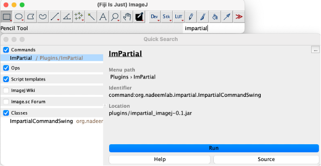
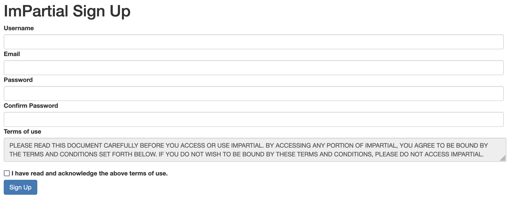
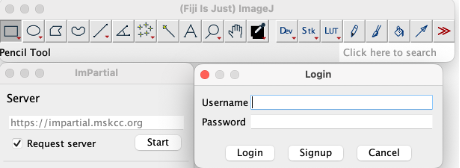
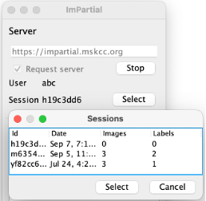
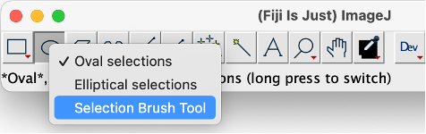
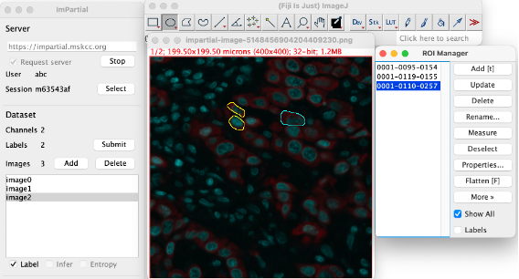

# ImPartial ImageJ Plugin

### Instructions to setup Fiji
-	Download [Fiji](https://imagej.net/software/fiji/downloads) (version >= 2.3.0) 
-	Download [Apache Maven](https://maven.apache.org/install.html) 
  (or use [brew](https://formulae.brew.sh/formula/maven) on macOS)

### Instructions to setup plugin:

-	Clone the impartial github repo
- from the repo root directory

    ```shell
    cd imagej-plugin
    mvn clean package
    ```
- and copy the `.jar` file into Fiji's plugins directory. For example, if you're using macOS
    ```shell
    cp target/impartial_imagej-0.1.jar /Applications/Fiji.app/plugins
    ```
-   Restart fiji 
-	Impartial Plugin can be found under plugin->impartial

    

### Plugin Features

Local setup 
-	Start the monai server:  monailabel start_server -a api -s  /dataset/
-	http://localhost:8000
-	All the data with the labels are saved at the “/dataset/” location given by the user when starting the server. 

GPU server request
-	Signup with credentials

    
-   Login with your user ID

    

-	User session is saved for each user with date and time as the id. User has access to the previous sessions. 
-	Each user session has a window of 2 hours at each login with a 5 min warning before the session ends. 
-	Restore session: User can restore the session by login-in with their credentials and clicking “select”

    

Dataset images 
- Click “ADD” to upload your images.
- Impartial supports .png and .tiff file formats 
- Multichannel images upto 3 channels 

Creating Labels 
-	Use the ‘selection brush tool’ from the Fiji toolbar

    

-	After creating each label add each label to the Roi Manager add label option. 
-	After all the labels are added for the image, press submit to upload the labels on the server. (Warning: do not switch to another image before submitting, otherwise your labels will not be saved)

    

-	User can also upload previously created/saved labels eg. “roi.zip” by clicking File > open > imageLabel.zip

Training

-	Training Hyperparameters: 
User can set the training hyperparameters according to the dataset and requirements. 
Recommended values: epochs=200, patches=2000, patience=50
-	Click 'start' to begin training.
-	User can see the progress of the training of number of epochs completed on Fiji toolbar. 


Infer
-	Press Infer to view the predictions. User can also change the thresholding to fine tune the results in real time.

Save model 
- User can download the trained model for future training/inference.


